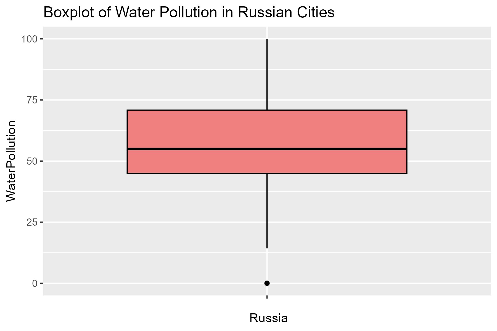
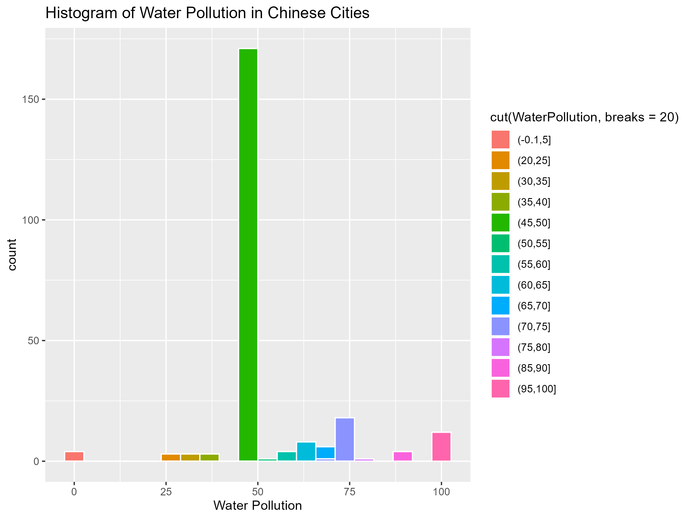

### 1. Introduction

#### 1.1 Objectives

This scholarly investigation is poised to systematically analyze the dataset concerning air quality and water pollution, diligently curated from the "World's Air Quality and Water Pollution" repository. Through the stringent application of robust sampling methodologies, specifically Simple Random Sampling (SRS) and Stratified Sampling, our primary aim is to procure samples of uniform size that impeccably represent the entirety of the population. This methodological precision not only ensures statistical rigour but also fortifies the reliability of our ensuing findings.

The core focus of this inquiry transcends the superficial, it seeks a nuanced comprehension of the intricate interplay between air quality and water pollution levels across diverse regions within China. Through the implementation of sophisticated sampling techniques, our aspiration is to unveil underlying patterns and variations that contribute profoundly to a holistic understanding of the environmental landscape. Positioned within the realm of academic pursuit, aiming to discern subtle distinctions and draw insightful comparisons that enrich the ever-expanding body of knowledge in environmental science.

This academic undertaking is not a mere exercise in the course, it represents a dedicated exploration into the intricate dynamics of environmental indicators. The overarching goal is to substantively contribute to the scholarly discourse surrounding the assessment of environmental quality, particularly within the context of Chinese regions. Through the lens of scientific inquiry, this study seeks to unravel the complexities inherent in environmental data, providing a robust foundation for informed decision-making and inspiring future avenues of research in the field.

### 2. Background

#### 2.1 Global Environmental Landscape

In the realm of environmental science, the metrics of air quality and water pollution emerge as pivotal indicators, fundamental for assessing both ecological well-being and human health. The intricate interplay between these factors exerts a profound influence on the delicate equilibrium of ecosystems, rendering them imperative focal points for rigorous scientific inquiry.

Against the backdrop of an escalating global population, the convergence of rapid urbanization and industrialization introduces a myriad of complexities into the fabric of environmental conditions. The nuanced dynamics at play underscore the urgent need for a comprehensive exploration of the state of our global environment. This study strategically positions itself within the scholarly discourse, drawing upon the extensive insights encapsulated in the "World's Air Quality and Water Pollution" dataset.

The selected dataset sourced from Jack Jae Hwan Kim's Kaggle repository, stands as an exhaustive compilation that mirrors the intricate tapestry of environmental quality on a global scale. By directing our scholarly attention to this repository, we embark on a purposeful journey to decipher the multifaceted dimensions of environmental health. This academic undertaking is propelled by the imperative not only to comprehend the present state of our environment but also to substantively contribute to ongoing dialogues surrounding global sustainability and the nuanced implications of local environmental policies.

In our exploration of this global environmental landscape, we position ourselves at the nexus of empirical analysis and theoretical inquiry. Our scholarly aim is to uncover overarching patterns and discern subtle nuances that characterize the current state of global environmental health. Through this academic exploration, our aspiration is to contribute layers of understanding to the broader field of environmental science, fostering a robust foundation for informed decision-making and policy formulation, imbued with a humanistic perspective.

#### 2.2 Dataset Overview
Procured from Jack Jae Hwan Kim's Kaggle repository, stands as a comprehensive exploration into the intricate web of global environmental conditions. Comprising five fundamental columns—City, Region, Country, Air Quality, and Water Pollution. The dataset offers a nuanced perspective on the prevailing state of our environment on a worldwide scale.

Each entry within this dataset encapsulates a vital snapshot of the environmental state, unfolding a narrative that spans diverse locations, encompassing major cities and regions across different countries. This diverse array affords us the opportunity for meticulous examination of the variations and contrasts in air quality and water pollution.

The Air Quality column, measured on a scale from 0 (indicating poor quality) to 100 (representing optimal conditions), serves as a direct indicator of atmospheric conditions. Simultaneously, the Water Pollution column, ranging from 0 (indicating no pollution) to 100 (denoting extreme pollution), offers profound insights into the health of our water bodies.

The dataset's richness extends beyond mere data points. Its depth renders it a valuable resource, not merely for academic exploration but as a possibly substantive contributor to the broader discourse on environmental sustainability and the potentially far-reaching implications of local environmental policies.

As we embark on a scholarly navigation through this dataset, our ultimate aim is to unravel global trends and patterns, providing a foundational understanding that serves as a precursor to our in-depth exploration of the unique environmental landscape within Chinese cities. Here, our approach will be based on two distinct sampling methods—Simple Random Sampling (SRS) and Stratified Sampling.

### 3. A Global Perspective: Unveiling Environmental Dynamics

In embarking on this preliminary exploration, our overarching objective is to provide a nuanced and comprehensive portrayal of global air quality and water pollution. This scholarly endeavour is firmly grounded in the rigorous application of statistical summaries and sophisticated visualizations, aligning with the scholarly pursuit of unravelling intricate trends and patterns inherent in environmental dynamics.

What's more, our aim transcends mere surface-level observations. We aspire to delve into the depths of environmental data, wielding analytical tools to elucidate not only the broad strokes but also choosing a global perspective that serves as a pivotal foundation, positioned to facilitate a profound analysis of specific territories.

Through systematic exploration, we endeavour to uncover variations and contrasts among diverse regions and countries, contributing to the holistic understanding of global environmental dynamics. This scholarly approach underscores our commitment to academic rigour, emphasizing the gravity of our pursuit. We aspire to illuminate the underlying principles governing the health of our planet's vital ecosystems, making this exploration a meaningful step in advancing the scholarly discourse in environmental science with a human touch.

***Let's First Check Out the Global Environment Trends!***

Before delving into the specifics of individual regions, it's crucial to understand the overarching trends in global air quality and water pollution. This initial exploration allows us to identify broad patterns that may influence our detailed analysis later on. 

Below are the boxplots representing air quality and water pollution in five countries (the People's Republic of China, the United States of America, Russia, France, United Kingdom). These visualizations provide a comparative analysis of environmental indicators, contributing to our broader understanding of global trends. 

### 4. Importance of Studying China

The intentional focus of this scholarly investigation on China, characterized by its rapid industrialization, urbanization, and densely populated urban centers, is rooted in the profound significance of the nation as a critical case study within the discipline of environmental science. China's distinctive environmental landscape, shaped by a confluence of historical, geographical, and sociology-economic factors, provides an unparalleled opportunity to unravel the complexities inherent in the intricate interactions between human activities and environmental quality.

Implicit in the fabric of this inquiry is the recognition that the examination of air quality and water pollution in Chinese cities transcends immediate concerns for citizens' well-being. China, as a major protagonist on the international stage, exerts considerable influence over global environmental discourse and policy formulation. Consequently, a comprehensive understanding of China's environmental policies and outcomes assumes pivotal importance in the broader global context.

As we delve into the environmental nuances of Chinese cities, our explicit aim is to contribute not only to the localized understanding of environmental health but also to the broader academic discourse on global environmental sustainability. 

It is important to seek to firmly position our study within the larger academic dialogue, recognizing the intrinsic value of scrutinizing China's environmental dynamics for their local and international ramifications. By immersing ourselves in the intricacies of China's environmental challenges, we aspire to offer insights that enrich the collective understanding of the complex interplay between human activities and environmental well-being.

To provide a visual foundation for our subsequent statistical analyses, here are two histograms depicting the distribution of air quality and water pollution in Chinese cities.

*The histogram illustrates the distribution of air quality levels in Chinese cities. The x-axis represents the Air Quality Index, while the y-axis shows the frequency of cities falling within specified air quality ranges. The histogram provides a visual overview of the variability in air quality across the sampled Chinese cities.*

*This histogram displays the distribution of water pollution levels in Chinese cities. The x-axis represents the Water Pollution index, and the y-axis depicts the frequency of cities falling within distinct water pollution ranges. The histogram offers insights into the diversity of water pollution levels across the sampled Chinese cities.*

### 5. Rationale for the Chinese Subset

With this deliberate narrowing of focus, as we navigate through the environmental intricacies of the world, our intention is to contribute valuable insights that foster a deeper comprehension of the intricate relationships between environmental variables and human activities. The decision to meticulously examine a subset within the dataset, with a specific concentration on Chinese cities, is intricately interwoven with the imperative to discern and comprehend the unique environmental challenges characterizing this expansive nation. China, serving as a microcosm of diverse environmental landscapes, presents a compelling case study that necessitates a more nuanced exploration.

Also, we choose to narrow our analytical focus to Chinese cities is grounded in the recognition of the multifaceted dimensions of environmental dynamics within the country. From the monumental scale of urban development to the intricate interplay of geographical and climatic variations, China encapsulates a rich tapestry of environmental challenges that demand meticulous examination.

